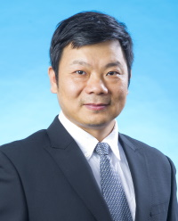

# Sheng CHEN (陳声)  

*DVM, MPVM, PhD*

#### Professor, [Department of Infectious Diseases and Public Health](https://scholars.cityu.edu.hk/en/organisations/department-of-infectious-diseases-and-public-health(61a0d3e4-08d1-4fd2-8845-6bb9e1d34ac9).html)

#### Associate Dean, [Jockey Club College of Veterinary Medicine and Life Sciences](https://scholars.cityu.edu.hk/en/organisations/jockey-club-college-of-veterinary-medicine-and-life-sciences(cd826bbf-ba46-40f2-b892-ffe866454729).html)

----

## Research Interests

Prof. Chen’s current research covers research on bacterial antimicrobial resistance, virulence and tolerance in the veterinary, food and medical microbiology fields. His research lies on the interface of clinical study and basic science using multi-disciplinary approaches including Genomics, Genetics, Biochemistry, Cell Biology and Chemical Biology with the ultimate goal of developing novel therapies to combat bacterial antimicrobial resistance.

Education
---------

2000 — 2004
**PhD, Food Microbiology degree**; University of Maryland

1997 — 2000
**Msc, Preventive Veterinary Medicine degree**; China Agriculture University

1994 — 1997
**BSc, Veterinary degree**; China Agriculture University

Experience
---------

Prof. Chen received his postdoctoral training in the Department of Microbiology and Molecular Genetics at the Medical College of Wisconsin, USA, in 2009.

Before joining City University of Hong Kong in 2019, he had spent 10 years working in the Department of Applied Biology and Chemical Technology at the Hong Kong Polytechnic University as Assistant Professor, Associate Professor and Professor.

Prof. Chen participates in the Hong Kong government’s policy making through an ad-hoc working group on microbial guidelines for ready-to-eat food under the Department of Food and Environmental Hygiene of Hong Kong Government. He is also a member of the Shenzhen Expert Committee to help the Shenzhen government’s decision making on the development of biotechnologies. He has established and served as the Director of the Shenzhen Key Laboratory for Food Biological Safety Control before joining CityU.

Open positions
---------

We have...

Contact 
---------

**Office Address**: Room 1B-407, 4/F, Block 1, To Yuen Building, 31 To Yuen Street, City University of Hong Kong

**Office Tel**: [+852 3442-5782](tel:+8523442-5782)

**Email**: [shechen@cityu.edu.hk](mailto:shechen@cityu.edu.hk)

**Biography URL**: [CityU Scholars](https://scholars.cityu.edu.hk/en/persons/sheng-chen(c7ce19c8-3b4a-4111-a8bb-d82c21cea074).html)

**ORCID iD**: [0000-0003-3526-7808](http://orcid.org/0000-0003-3526-7808)

**Scopus Author ID**: [56148872100](https://www.scopus.com/authid/detail.uri?authorId=56148872100)

